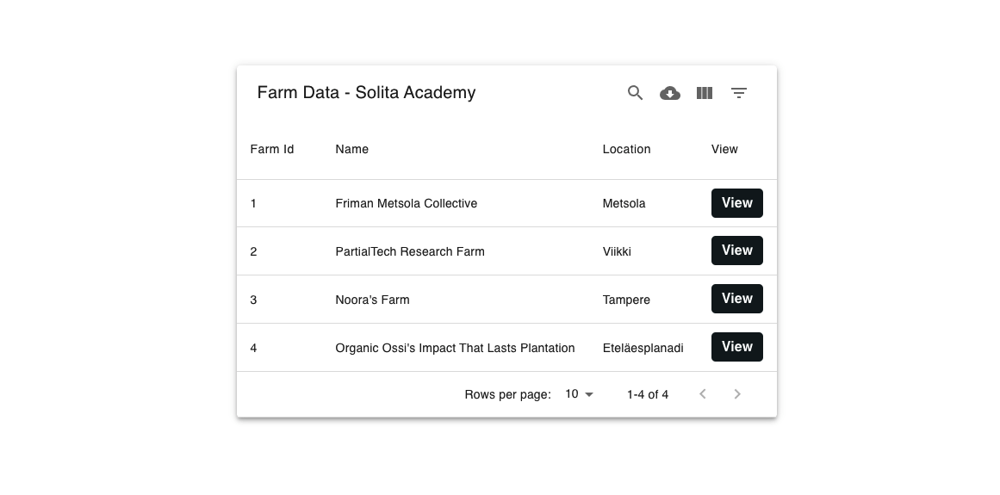

# Farm data Solita Academy task

This is the solution to Solita Academy farm data task. This app is the frontend for displaying data from different farms. It shows all the available farms in the homepage, detail page for each farm and statistics data for each farm as well.

## Demo Picture

# 

## Author

Sulaymon Tajudeen

## Tech Stack

-   React
-   CSS
-   React Router DOM
-   Mui Datatable

## License

This project is licensed under the MIT License - see the [LICENSE](./LICENSE) file for details.

## Running the server for frontend project

-   Install Java runtime environment (version 8 or newer)
-   Clone the repository from [solita-farm-data-task](https://github.com/solita/dev-academy-2022-exercise.git)
-   start the server with command `java -jar bin/exercise-server.jar`
-   You can view OpenApi-documentation from http://localhost:8080
-   Make your react app points to the right base Url http://localhost:8080
-   For CORS errors set `proxy:"http://localhost:8080"` in your react app package.json file and add `{ mode: 'cors' }` for your fetch API as well.
